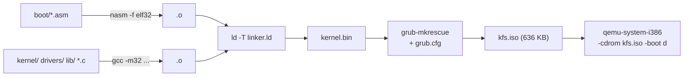
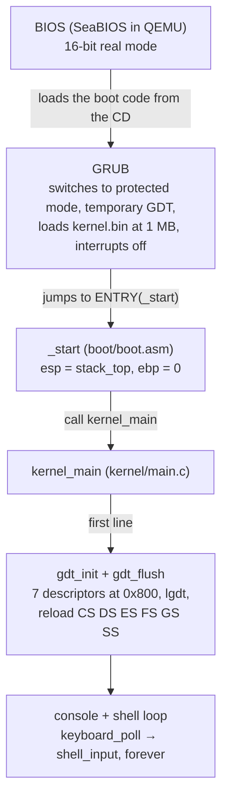
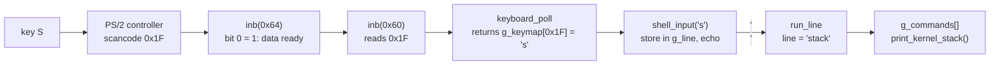
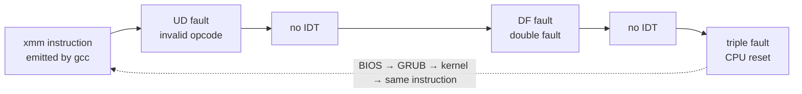

# kfs-2 — GDT & Stack

Second step of the 42 *Kernel From Scratch* series, built on top of kfs-1.
The kernel is an i386 multiboot ELF booted by GRUB, written in C and NASM.

kfs-2 adds two things to kfs-1:

1. **Our own Global Descriptor Table**, at physical address `0x00000800`,
   loaded into the CPU with `lgdt`.
2. **A kernel stack printer** that shows the stack in a human-friendly way:
   a hexdump plus the chain of call frames.

A small debug shell (bonus) exposes both, plus `reboot` and `halt`.

## Contents

- [Build and run](#build-and-run)
- [Subject checklist](#subject-checklist)
- [Concepts](#concepts)
  - [From power-on to the shell](#from-power-on-to-the-shell)
  - [Memory map](#memory-map)
  - [Segments and the flat model](#segments-and-the-flat-model)
  - [The 8-byte descriptor](#the-8-byte-descriptor)
  - [The access byte](#the-access-byte)
  - [Selectors](#selectors)
  - [GDTR, `lgdt` and the far jump](#gdtr-lgdt-and-the-far-jump)
  - [Privilege rings](#privilege-rings)
  - [The stack](#the-stack)
  - [Stack frames and the backtrace](#stack-frames-and-the-backtrace)
- [What changed since kfs-1](#what-changed-since-kfs-1)
- [Reading the real output](#reading-the-real-output)
- [Verification procedure](#verification-procedure)
- [Pitfalls worth knowing](#pitfalls-worth-knowing)
- [Layout](#layout)
- [Glossary](#glossary)

## Build and run

```sh
make            # builds kfs.iso
make run        # boots it in QEMU (KVM=1 make run to enable KVM)
make check      # verifies the multiboot header and the 10 MB limit
```

Requirements: gcc (32-bit target), nasm, ld, grub-mkrescue, xorriso, qemu-system-i386.

On macOS there is no native toolchain: `make docker` builds the ISO inside a
Linux container (see [Dockerfile](Dockerfile)), then `make run` boots it with
the host QEMU. `make check` also works there: `grub-file` does not exist on
macOS, so the multiboot check runs in the container. `make docker-shell`
opens a shell in it.



## Subject checklist

| Requirement | Where |
|---|---|
| Create a Global Descriptor Table | [kernel/gdt.c](kernel/gdt.c) — `gdt_init()` |
| Kernel code, kernel data, kernel stack, user code, user data, user stack | `g_segments[]`: 6 segments + the mandatory null entry = 7 entries |
| Declare the GDT to the BIOS | [boot/gdt_flush.asm](boot/gdt_flush.asm) — `lgdt` (it is the CPU, not the BIOS, that reads the table) |
| GDT at address `0x00000800` | [linker.ld](linker.ld) — `gdt_table = 0x00000800;` |
| Print the kernel stack in a human-friendly way | [kernel/stack.c](kernel/stack.c) — `print_kernel_stack()` |
| printk | from kfs-1, plus zero-padded widths (`%08x`) |
| Work under 10 MB | `make check` — the ISO is 636 KB |
| Makefile, own linker script, i386 | [Makefile](Makefile), [linker.ld](linker.ld), `-m32` / `elf_i386` |
| Bonus: debug shell (print stack, reboot, halt…) | [kernel/shell.c](kernel/shell.c) |

## Concepts

### From power-on to the shell

The CPU wakes up in 16-bit **real mode**: 1 MB of addressable memory and no
protection. GRUB switches it to 32-bit **protected mode**, where every memory
access goes through a segment described in the GDT. GRUB installs a temporary
GDT of its own; replacing it is the first thing the kernel does.



The multiboot specification says GRUB's GDTR may be invalid and that the
kernel must not load any segment register until it has its own GDT. The C
code in `gdt_init()` runs fine on GRUB's segments because each segment
register keeps a hidden copy of its descriptor (the *descriptor cache*): as
long as no register is reloaded, the old table is never read again.

### Memory map

High addresses at the top, not to scale. The stack bounds come from
`nm build/isodir/boot/kernel.bin`.

```
0xFFFFFFFF ┌──────────────────────────────┐
           │ no RAM behind these addresses│  QEMU runs with -m 64
0x04000000 ├──────────────────────────────┤
           │ free RAM                     │  future heap / paging
≈0x0010A000├──────────────────────────────┤
           │ .bss: screens, g_line, ...   │  zero-initialised globals
0x00106000 ├──────────────────────────────┤  ← stack_top, esp starts here
           │ kernel stack (16 KB)         │    and grows downwards ↓
0x00102000 ├──────────────────────────────┤  ← stack_bottom
           │ .text .rodata .data          │  kernel code, loaded by GRUB
0x00100000 ├──────────────────────────────┤  1 MB
           │ VGA (0xB8000), BIOS ROM      │  devices, not RAM
0x000A0000 ├──────────────────────────────┤
           │ low RAM (free)               │
0x00000838 ├──────────────────────────────┤
           │ GDT: 7 × 8 = 56 bytes        │  ← required by the subject
0x00000800 ├──────────────────────────────┤
           │ real-mode IVT + BIOS data    │
0x00000000 └──────────────────────────────┘
```

A 32-bit CPU can address 4 GB. That is the range the segments describe; it
says nothing about how much RAM is actually installed.

### Segments and the flat model

A **segment** is a window over memory with a **base** (where it starts), a
**limit** (how big it is) and **access rights** (who may use it, code or
data, writable or not). The CPU adds the base to every offset and checks the
result against the limit:

```
   0                base            base + limit                4 GB
   ├──────────────────┬───────────────────┬─────────────────────┤
                      │ ←── offset ──→•   │
                      └──── segment ──────┘
   linear address = base + offset   (offset > limit → fault)
```

This kernel uses the **flat model**: every segment has base 0 and a 4 GB
limit, so `base + offset = offset` and a C pointer is the real address. The
six segments only differ in privilege level and in type:

```
                     0                                          4 GB
0x08 kernel code     ████████████████████████████████████████████  ring 0 · code
0x10 kernel data     ████████████████████████████████████████████  ring 0 · data
0x18 kernel stack    ████████████████████████████████████████████  ring 0 · data
0x20 user code       ████████████████████████████████████████████  ring 3 · code
0x28 user data       ████████████████████████████████████████████  ring 3 · data
0x30 user stack      ████████████████████████████████████████████  ring 3 · data
```

Isolating memory is left to paging (later subjects). The GDT is still
required: protected mode cannot run without it, and the privilege level
lives there.

### The 8-byte descriptor

Each GDT entry is 8 bytes. For compatibility with the 80286, the base is
split into three pieces and the limit into two. `t_gdt_entry` in
[include/gdt.h](include/gdt.h) mirrors this layout exactly;
`__attribute__((packed))` stops the compiler from inserting padding.

```
           byte 0-1      byte 2-3    byte 4   byte 5   6 hi   6 lo    byte 7 
       ┌─────────────┬─────────────┬────────┬────────┬──────┬──────┬─────────┐
       │  limit_low  │   base_low  │base_mid│ access │flags │ lim  │base_high│
       │ limit 0..15 │  base 0..15 │ 16..23 │        │4 bits│16..19│  24..31 │
       └─────────────┴─────────────┴────────┴────────┴──────┴──────┴─────────┘
kernel      ff ff         00 00        00       9a      c      f        00   
code
```

Building the kernel code descriptor by hand (base 0, limit `0xFFFFF`, access
`0x9A`, flags `0xC`), exactly as `gdt_set_entry()` does:

| Field | Computation | Result |
|---|---|---|
| `limit_low` | `0xFFFFF & 0xFFFF` | `0xFFFF` → bytes `ff ff` |
| `base_low` | `0x0 & 0xFFFF` | `0x0000` |
| `base_mid` | `(0x0 >> 16) & 0xFF` | `0x00` |
| `access` | `ACCESS_CODE(ACC_RING0)` | `0x9A` |
| `granularity` | `((0xFFFFF >> 16) & 0x0F) \| (0xC << 4)` = `0x0F \| 0xC0` | `0xCF` |
| `base_high` | `(0x0 >> 24) & 0xFF` | `0x00` |

The flags nibble `0xC` = `1100`: **G = 1** (the limit counts 4 KB pages, so
`0xFFFFF` pages = 4 GB) and **D/B = 1** (32-bit segment).

**Little-endian.** QEMU's `xp /14wx 0x800` prints 32-bit words. On x86 the
lowest byte of a word sits at the lowest address, so a word reads backwards
compared to memory:

| Address | Word shown by `xp` | Bytes in memory order | Fields |
|---|---|---|---|
| `0x808` | `0x0000ffff` | `ff ff 00 00` | limit_low `ffff`, base_low `0000` |
| `0x80c` | `0x00cf9a00` | `00 9a cf 00` | base_mid `00`, access `9a`, granularity `cf`, base_high `00` |

### The access byte

```
 bit:     7       6   5         4        3       2         1          0
      ┌────────┬──────────┬───────────┬──────┬────────┬──────────┬──────────┐
      │   P    │   DPL    │     S     │  E   │   DC   │    RW    │    A     │
      ├────────┼──────────┼───────────┼──────┼────────┼──────────┼──────────┤
0x9A  │   1    │  0   0   │     1     │  1   │   0    │    1     │    0     │
      └────────┴──────────┴───────────┴──────┴────────┴──────────┴──────────┘
       present    ring 0    code/data   code   normal   readable   accessed
                                                                  (set by CPU)

      1 00 1 1 0 1 0  →  1001 1010  →  0x9A
```

[kernel/gdt.c](kernel/gdt.c) names each bit and ORs them together instead of
using magic numbers:

| Segment | Formula | Sum | Value |
|---|---|---|---|
| kernel code | `PRESENT \| RING0 \| SEGMENT \| EXEC \| RW` | `0x80\|0x00\|0x10\|0x08\|0x02` | **0x9A** |
| kernel data, kernel stack | `PRESENT \| RING0 \| SEGMENT \| RW` | `0x80\|0x00\|0x10\|0x02` | **0x92** |
| user code | `PRESENT \| RING3 \| SEGMENT \| EXEC \| RW` | `0x80\|0x60\|0x10\|0x08\|0x02` | **0xFA** |
| user data, user stack | `PRESENT \| RING3 \| SEGMENT \| RW` | `0x80\|0x60\|0x10\|0x02` | **0xF2** |

`ACC_RING3` is `0x60` because the DPL sits in bits 6–5: ring 3 is `11`,
shifted left by 5 gives `0110 0000`.

### Selectors

A segment register (CS, DS, ES, FS, GS, SS) holds a **selector**: the index
of a GDT entry plus two small fields. With both at 0, the selector is simply
`index × 8`, which is also the byte offset of the entry in the table.

```
 bit:  15 ............................. 3    2      1  0
      ┌────────────────────────────────┬──────┬────────┐
0x0010│   0000 0000 0001 0  (index 2)  │ TI 0 │ RPL 00 │
      └────────────────────────────────┴──────┴────────┘
                                         GDT    ring 0
```

After `gdt_flush`, the registers point at these entries:

```
 register            selector      GDT @ 0x800
                                   ┌──────────────────────────┐
                                   │ 0x800  0x00 null         │
 CS  ───────────────  0x08  ─────► │ 0x808  0x08 kernel code  │
 DS ES FS GS ───────  0x10  ─────► │ 0x810  0x10 kernel data  │
 SS  ───────────────  0x18  ─────► │ 0x818  0x18 kernel stack │
                                   │ 0x820  0x20 user code    │  not loaded yet
                                   │ 0x828  0x28 user data    │  not loaded yet
                                   │ 0x830  0x30 user stack   │  not loaded yet
                                   └──────────────────────────┘
```

A selector is a position in the table, not an address: `SS = 0x18` means
"use the rules of entry 3 for the stack".

### GDTR, `lgdt` and the far jump

The CPU finds the table through the **GDTR** register: a 16-bit limit (size
minus one) and a 32-bit base. `lgdt` copies these 6 bytes from memory into the
CPU. `t_gdt_ptr` in [kernel/gdt.c](kernel/gdt.c) is that 6-byte image.

```
 GDTR (inside the CPU)                       memory
┌──────────────┬──────────────────┐        ┌──────────────┐ 0x800
│ limit 0x0037 │ base 0x00000800  │ ─────► │ null         │
└──────────────┴──────────────────┘        │ kernel code  │
  56 - 1 = 55     where the table          │ kernel data  │
                  starts                   │ kernel stack │   56 bytes
                                           │ user code    │   (0x37 + 1)
                                           │ user data    │
                                           │ user stack   │
                                           └──────────────┘ 0x837
```

`lgdt` changes the GDTR and nothing else. Each segment register still holds
GRUB's descriptor in its hidden cache until it is reloaded:

```
 1. from GRUB                 2. after lgdt                3. after gdt_flush
┌──────────────────────┐     ┌──────────────────────┐     ┌──────────────────────┐
│ CS  = GRUB's value   │     │ CS  = old (cached)   │ jmp │ CS  = 0x08           │
│ DS… = GRUB's value   │     │ DS… = old (cached)   │ mov │ DS ES FS GS = 0x10   │
│ SS  = GRUB's value   │     │ SS  = old (cached)   │ mov │ SS  = 0x18           │
│ GDTR → GRUB's table  │lgdt │ GDTR → 0x800         │     │ GDTR → 0x800         │
└──────────────────────┘     └──────────────────────┘     └──────────────────────┘
```

There is no `mov cs, ax` on x86: CS changes only through a control transfer.
`jmp 0x08:.reload_segments` sets CS to `0x08` and continues on the next line.
The other registers are reloaded with `mov` through `ax`.

The `t_gdt_ptr` passed to `lgdt` is a local variable in `gdt_init()`. That is
fine: the CPU copies the 6 bytes and never reads them again. The table itself
must stay, which is why it lives at `0x800`.

### Privilege rings

```
        ┌───────────────────────────────┐
        │ ring 3 — user programs        │  DPL 11 (0xFA, 0xF2)
        │   ┌───────────────────────┐   │  defined, not used yet
        │   │ ring 2, ring 1        │   │  exist, unused in practice
        │   │   ┌───────────────┐   │   │
        │   │   │ ring 0        │   │   │  DPL 00 (0x9A, 0x92)
        │   │   │ kernel        │   │   │  all of our code
        │   │   └───────────────┘   │   │
        │   └───────────────────────┘   │
        └───────────────────────────────┘
```

- **DPL** (Descriptor Privilege Level): the level of a segment, in its access byte.
- **CPL** (Current Privilege Level): the level of the running code, the low 2 bits of CS.
- **RPL** (Requested Privilege Level): the low 2 bits of a selector.

Code running with CPL 3 cannot touch ring 0 segments or execute privileged
instructions such as `lgdt`, `cli` or `hlt`. The user segments are defined so
that the table is complete; switching to ring 3 needs a TSS and an IDT, which
are topics for later subjects.

### The stack

The stack is LIFO: the last value pushed is the first popped. On x86 it grows
**downwards**: `push` subtracts 4 from `esp` then writes; `pop` reads then
adds 4. `esp` always points at the most recent value, and everything from
`esp` up to `stack_top` is in use.

```
            1. empty        2. push 0x2A     3. push 0x07     4. pop eax
          ┌──────────┐    ┌──────────┐     ┌──────────┐     ┌──────────┐
 0x105ffc │          │    │   0x2A   │◄esp │   0x2A   │     │   0x2A   │◄esp
          ├──────────┤    ├──────────┤     ├──────────┤     ├──────────┤
 0x105ff8 │          │    │          │     │   0x07   │◄esp │  (0x07)  │ free again
          ├──────────┤    ├──────────┤     ├──────────┤     ├──────────┤
 0x105ff4 │          │    │          │     │          │     │          │
          └──────────┘    └──────────┘     └──────────┘     └──────────┘
 esp =      0x106000        0x105ffc         0x105ff8         0x105ffc, eax = 0x07
```

[boot/boot.asm](boot/boot.asm) reserves 16 KB in `.bss` (`resb 16384`, which
takes no space in the binary), aligned on 16 bytes as the System V i386 ABI
requires. `_start` sets `esp` to `stack_top` because the multiboot
specification does not guarantee its value; C cannot run before this.
After `gdt_flush`, SS uses the kernel stack selector `0x18`.

### Stack frames and the backtrace

With `-fno-omit-frame-pointer`, every function starts with:

```nasm
push ebp        ; save the caller's ebp ("saved ebp")
mov  ebp, esp   ; anchor this function's frame here
```

So in every function `[ebp]` is the caller's saved `ebp` and `[ebp+4]` is the
return address pushed by `call`. Following `[ebp]` walks up the callers.
`_start` zeroes `ebp`, so the chain ends at 0.

The real stack while the `stack` command runs (values from QEMU):

```
                address    value        meaning
 stack_top ──►  0x106000   ─────────────────────────────────────────────────
                0x105ffc   0x0010001c   return address → into _start           ┐ frame #2
                0x105ff8   0x00000000   saved ebp = 0 → end of the chain       │ kernel_main
                           ...          kernel_main's locals                   ┘ ebp = 0x105ff8
                0x105fdc   0x00100115   return address → into kernel_main      ┐ frame #1
                0x105fd8   0x00105ff8   saved ebp → frame #2 (↑)               │ shell_input
                           ...          shell_input's locals                   ┘ ebp = 0x105fd8
                0x105fbc   0x00100d1e   return address → into shell_input      ┐ frame #0
       ebp ──►  0x105fb8   0x00105fd8   saved ebp → frame #1 (↑)               │ print_kernel_stack
                           ...          print_kernel_stack's locals            ┘ ebp = 0x105fb8
       esp ──►  0x105f84
```

Loop: `frame = ebp`; print `frame[1]`; `frame = frame[0]`; stop when `frame`
leaves the stack bounds.

`run_line` and `dump_line` never show up: at `-O2` GCC inlines these small
static functions into their callers, so they have no frame of their own.

## What changed since kfs-1

About 660 lines of code were added, plus the documentation. The kfs-1 screen,
VGA and string code (`console.c`, `vga.c`, `string.c`) is untouched.

### A. GDT — `include/gdt.h`, `kernel/gdt.c`, `boot/gdt_flush.asm`, `linker.ld`

**linker.ld** defines one *symbol*, not a section:

```ld
gdt_table = 0x00000800;
```

No byte is added to the binary. The symbol only tells the C code where
`gdt_table` is. A section is impossible because GRUB refuses to load ELF
segments below 1 MB, and a constant pointer `(t_gdt_entry *)0x800` fails
under `-Werror` with `-Warray-bounds`.

**include/gdt.h** declares the packed 8-byte `t_gdt_entry`, `GDT_ENTRIES`
(7) and `extern t_gdt_entry gdt_table[GDT_ENTRIES]`. Because the size is part
of the declaration, `sizeof(gdt_table)` is 56.

**kernel/gdt.c**

- `ACC_*` bits and the `ACCESS_CODE(ring)` / `ACCESS_DATA(ring)` macros
  rebuild `0x9A`, `0x92`, `0xFA` and `0xF2`. `FLAGS_32BIT_4K` is `0xC`,
  `LIMIT_4GB` is `0xFFFFF`.
- `g_segments[]` holds the name and access byte of each entry. It is the only
  place that defines the table's layout, used by both `gdt_init` and
  `gdt_print`. The row number is the selector: `index × 8`.
- `gdt_set_entry()` splits base and limit into the scattered fields:

  ```c
  gdt_table[i].limit_low   = (uint16_t)(limit & 0xFFFF);
  gdt_table[i].base_low    = (uint16_t)(base & 0xFFFF);
  gdt_table[i].base_mid    = (uint8_t)((base >> 16) & 0xFF);
  gdt_table[i].access      = access;
  gdt_table[i].granularity = (uint8_t)(((limit >> 16) & 0x0F) | (flags << 4));
  gdt_table[i].base_high   = (uint8_t)((base >> 24) & 0xFF);
  ```

- `gdt_init()` zeroes entry 0 (the null descriptor), fills entries 1–6 with
  base 0, limit 4 GB, flags `0xC` and the access byte from `g_segments`,
  then fills the GDTR image and calls the assembly:

  ```c
  ptr.limit = sizeof(gdt_table) - 1;   /* 56 - 1 = 0x37 */
  ptr.base  = (uint32_t)gdt_table;     /* 0x800 */
  gdt_flush(&ptr);
  ```

- `gdt_print()` reads the table back from `0x800`, reassembles base and limit
  from their pieces and prints one line per entry. It shows what the CPU
  sees, including the accessed bit.

**boot/gdt_flush.asm**

```nasm
gdt_flush:
    mov eax, [esp + 4]          ; cdecl: [esp] = return address, [esp+4] = &ptr
    lgdt [eax]                  ; GDTR ← 6 bytes at eax
    jmp KERNEL_CODE:.reload_segments   ; far jump: CS = 0x08
.reload_segments:
    mov ax, KERNEL_DATA         ; segment registers cannot take an immediate
    mov ds, ax
    mov es, ax
    mov fs, ax
    mov gs, ax
    mov ax, KERNEL_STACK
    mov ss, ax                  ; SS = 0x18, the kernel stack entry
    ret                         ; base 0 everywhere: the return address is unchanged
```

### B. Stack — `boot/boot.asm`, `include/stack.h`, `kernel/stack.c`

**boot/boot.asm** gained three lines:

```nasm
global stack_bottom             ; the stack bounds are visible from C
global stack_top
...
_start:
    mov esp, stack_top
    xor ebp, ebp                ; 0 marks the end of the frame chain
    call kernel_main
```

**kernel/stack.c**

- `print_kernel_stack()` reads its own `ebp` with
  `__builtin_frame_address(0)` and `esp` with one line of inline assembly
  (`mov %%esp, %0`). It prints the bounds, the size (16384) and the bytes in
  use (`stack_top - esp`). It then rounds `esp` down to 16
  (`esp & ~15`), dumps at most 12 lines so the output fits on a 25-line
  screen, and calls `print_frames`.
- `dump_line()` prints one line: the address, four 32-bit words and the same
  16 bytes as ASCII (`.` for anything that is not printable), like
  `hexdump -C`.
- `print_frames()` walks the saved-`ebp` chain. It stops when a frame leaves
  `[stack_bottom, stack_top - 8]` (the 0 written by `_start` does) or after
  6 frames:

  ```c
  while ((uint8_t *)frame >= stack_bottom && (uint8_t *)frame + 8 <= stack_top
      && depth < MAX_FRAMES)
  {
      printk("  #%d  ebp=%p  return to %p\n", depth, (void *)frame, (void *)frame[1]);
      frame = (const uint32_t *)frame[0];
      depth++;
  }
  ```

### C. printk — `kernel/printk.c`, `include/printk.h`

Zero-padded widths (`%08x`, `%02x`, `%05x`) keep the stack and GDT columns
aligned. The format parser reads the digits after `%0`:

```c
if (format[i] == '0')
{
    i++;
    while (format[i] >= '0' && format[i] <= '9')
        width = width * 10 + (size_t)(format[i++] - '0');
}
```

`print_uint(value, base, width)` collects the digits in reverse (`value %
base`, then `value /= base`), appends `'0'` until `width` digits are stored,
then prints the buffer backwards. Appending to the reversed buffer is what
pads on the left.

### D. Debug shell and keyboard (bonus) — `kernel/shell.c`, `include/shell.h`, `drivers/keyboard.c`, `include/keyboard.h`



- `keyboard_poll()` now **returns** the character (0 for nothing, a key
  release, a modifier or an Alt+1..4 shortcut) instead of printing it. The
  shell owns the echo; otherwise every character would appear twice.

  ```diff
  -void keyboard_poll(void)
  +char keyboard_poll(void)
  ...
  -	c = g_shift ? g_keymap_shift[code] : g_keymap[code];
  -	if (c != 0)
  -		console_putchar(c);
  +	return (g_shift ? g_keymap_shift[code] : g_keymap[code]);
  ```

- `keyboard_reboot()` writes `0xFE` to the PS/2 controller's command port
  `0x64`, which pulses the CPU reset line (the classic pre-ACPI reboot).
- `g_commands[]` maps a name and a help line to a function pointer
  (`void (*run)(void)`). Most commands point straight at existing functions:

  | Command | Function | Effect |
  |---|---|---|
  | `help` | `cmd_help` | list the commands |
  | `stack` | `print_kernel_stack` | print the kernel stack |
  | `gdt` | `gdt_print` | print the 7 descriptors at 0x800 |
  | `clear` | `console_clear` | clear the screen |
  | `reboot` | `keyboard_reboot` | pulse the CPU reset line (port 0x64) |
  | `halt` | `cmd_halt` | `cli` + `hlt` forever |

- `shell_input()` runs the line on Enter, erases on backspace (never past
  the prompt) and stores printable characters up to `LINE_MAX - 1` so the
  64-byte buffer always has room for the final `'\0'`.
- `run_line()` trims spaces on both sides, ignores an empty line, looks the
  command up with `k_strcmp` and prints `unknown command: '...'` otherwise.

Alt+1..4 still switches between the four virtual screens from kfs-1.

### E. Boot flow — `kernel/main.c`

The kfs-1 `print_banner()` and `print_info()` (printk test lines) are gone.
`kernel_main` now runs:

```c
gdt_init();          /* first: replace GRUB's temporary GDT */
console_init();
draw_screens();      /* header, "42", "GDT loaded at 0x800", prompt on each screen */
while (TRUE)
{
    c = keyboard_poll();
    if (c != 0)
        shell_input(c);
}
```

The address on the banner is read from the `gdt_table` symbol, not written
by hand, so seeing `0x800` on screen also proves the linker symbol works.

### F. Build — `Makefile`, `grub/grub.cfg`, `Dockerfile`

| Change | What it does | Without it |
|---|---|---|
| new sources `gdt_flush.asm`, `gdt.c`, `stack.c`, `shell.c` | added to the build | `undefined reference` at link time |
| `-fno-omit-frame-pointer` | every function starts with `push ebp; mov ebp, esp` | no saved-`ebp` chain, no backtrace |
| `-mgeneral-regs-only` | general-purpose registers only: no SSE, MMX, x87 | triple fault on the first `xmm` instruction (see [pitfalls](#pitfalls-worth-knowing)) |
| GRUB `part_*` modules | partition-map modules shipped in the ISO | one "part_xxx.mod not found" line per module at boot |
| QEMU `-boot d` | the BIOS tries the CD first | slower boot (hard disk and floppy tried first) |
| `docker`, `docker-shell`, `make check` fallback | builds and checks inside a Linux container on macOS | no 32-bit gcc or grub-mkrescue on macOS |
| `grub.cfg` | menu entry renamed "KFS-2" | — |

The subject's `-fno-builtin`, `-fno-stack-protector`, `-nostdlib` and
`-nodefaultlibs` are used, plus `-ffreestanding`. `-fno-exceptions` and
`-fno-rtti` are C++ flags with no C equivalent, adapted away as the subject
allows.

## Reading the real output

### `stack`

```
kfs> stack
kernel stack: 0x102000 - 0x106000 (16384 bytes), 124 in use
esp=0x105f84  ebp=0x105fb8
00105f80:  001012af 001012af 00105fb8 0010042d  |....-...._..-...|
00105f90:  00105fb8 00105fa0 00000001 00105f90  |._..._......._..|
00105fa0:  00000004 00109f00 00105fd8 00109f00  |........._......|
00105fb0:  00000001 0000000c 00105fd8 00100d1e  |........._......|
00105fc0:  00000007 0000000a 00105fe8 00000004  |........._......|
00105fd0:  00000000 00000000 00105ff8 00100115  |........._......|
00105fe0:  0000000a 00000000 00000004 00100105  |................|
00105ff0:  00000000 00010000 00000000 0010001c  |................|
call frames:
  #0  ebp=0x105fb8  return to 0x100d1e
  #1  ebp=0x105fd8  return to 0x100115
  #2  ebp=0x105ff8  return to 0x10001c
```

| Part | How to read it |
|---|---|
| `0x102000 - 0x106000 (16384 bytes)` | `stack_bottom` and `stack_top`, 0x4000 = 16 KB apart |
| `124 in use` | `0x106000 - 0x105f84 = 0x7c = 124` |
| `00105f80:` | the dump starts at `esp` rounded down to 16, so the first word (`0x105f80`) is below `esp` and not in use |
| four columns | words at +0, +4, +8, +12; `0x105fb8` is the third column of line `00105fb0` |
| `\|...\|` | the same 16 bytes as ASCII; `0x5f` = `_`, `0x2d` = `-` |
| frame pairs | each saved `ebp` (column 3 of lines `fb0`, `fd0`, `ff0`) is followed by its return address (column 4); the chain ends at the `00000000` at `0x105ff8` |

The first line's ASCII column may not match its words: the words and the
ASCII are read at different moments and the `printk` calls in between use
the bottom of the stack.

To map a return address to a function, list the symbols with
`nm -n build/isodir/boot/kernel.bin`. An address belongs to the closest
symbol below it:

```
00100010 T _start          ← 0x10001c: the cli right after "call kernel_main"
00100050 T kernel_main     ← 0x100115: right after "call shell_input"
...
00100950 T print_kernel_stack
00100bb0 T shell_input     ← 0x100d1e: right after the g_commands[i].run() call
00100d20 T vga_write_cell
...
00102000 B stack_bottom
00106000 B stack_top
```

### `gdt`

```
kfs> gdt
GDT at 0x800 (7 entries):
  sel   segment       base        limit    access  flags
  0x00  null          0x00000000  0x00000  0x00    0x0
  0x08  kernel code   0x00000000  0xfffff  0x9a    0xc
  0x10  kernel data   0x00000000  0xfffff  0x93    0xc
  0x18  kernel stack  0x00000000  0xfffff  0x93    0xc
  0x20  user code     0x00000000  0xfffff  0xfa    0xc
  0x28  user data     0x00000000  0xfffff  0xf2    0xc
  0x30  user stack    0x00000000  0xfffff  0xf2    0xc
```

`0x93` instead of `0x92` is the **accessed** bit (bit 0), set by the CPU when
DS/ES/FS/GS load `0x10` and SS loads `0x18`. The user entries are never loaded
and stay at `0xf2`. Kernel code stays at `0x9a` under QEMU, which does not set
the bit on a far jump; real hardware may show `0x9b`. The limit column is the
raw 20-bit field; the G flag turns it into 4 GB.

### QEMU monitor

```
(qemu) info registers
CS =0008 00000000 ffffffff 00cf9a00 DPL=0 CS32 [-R-]
SS =0018 00000000 ffffffff 00cf9300 DPL=0 DS   [-WA]
DS =0010 00000000 ffffffff 00cf9300 DPL=0 DS   [-WA]
GDT=     00000800 00000037

(qemu) xp /14wx 0x800
00000800: 0x00000000 0x00000000 0x0000ffff 0x00cf9a00
00000810: 0x0000ffff 0x00cf9300 0x0000ffff 0x00cf9300
00000820: 0x0000ffff 0x00cffa00 0x0000ffff 0x00cff200
00000830: 0x0000ffff 0x00cff200
```

| Part | Meaning |
|---|---|
| `CS =0008` | the visible selector |
| `00000000 ffffffff` | base and limit in bytes from the hidden descriptor cache (G applied) |
| `00cf9a00` | the descriptor's second word: flags `c`, limit high `f`, access `9a` |
| `DPL=0 CS32 [-R-]` | ring 0, 32-bit code, readable, not accessed |
| `[-WA]` | writable and accessed: the letters for `0x93` |
| `GDT= 00000800 00000037` | GDTR: base `0x800`, limit `0x37`, the proof the subject asks for |
| `xp /14wx 0x800` | 14 words (7 descriptors × 2) from `0x800`, little-endian |

## Verification procedure

1. `make re && make check` (macOS: `make docker && make check`): expect
   `multiboot: OK` and `size: under 10 MB OK`.
2. `make run`: the screen shows *GDT loaded at 0x800, kernel stack ready.*
   and the `kfs>` prompt.
3. `gdt`: the 7 entries; explain the selectors, the access bytes and `0x93`.
4. `stack`: bounds, bytes in use, dump and 3 frames; point at a saved `ebp` /
   return address pair.
5. Open the QEMU monitor (Ctrl+Alt+2 in the window, Ctrl+Option+2 on macOS,
   back with …+1):
   `info registers` → `CS=0008`, `DS=0010`, `SS=0018`, `GDT= 00000800 00000037`.
6. `xp /14wx 0x800`: the 7 descriptors; decode `0x00cf9a00` byte by byte.
7. `help`, `clear`, Alt+2: bonus features.
8. `halt` (prints *System halted.* and freezes), then boot again and `reboot`
   (back to GRUB).

## Pitfalls worth knowing

**`-mgeneral-regs-only` or a reboot loop.** On an x86-64 host, `gcc -m32`
still enables SSE2 and vectorises loops with `xmm` registers. SSE is disabled
at boot (`CR4.OSFXSR = 0`), so the first such instruction raises an invalid
opcode. With no IDT there is no handler, so the CPU escalates:



Found with `qemu -d int -no-reboot`.

**No expand-down stack segment.** The expand-down bit (`0x04`) exists for
stacks, but with a 4 GB limit it makes every offset invalid on real hardware.
QEMU does not check limits and hides the mistake. A plain writable data
segment in its own entry is correct and simpler.

**No `hlt` in the main loop.** GRUB leaves interrupts disabled (IF = 0) and
there is no IDT to allow `sti`. `hlt` with IF = 0 never wakes up, so the main
loop polls the keyboard instead.

**The BIOS is not involved.** "Declare the GDT to the BIOS" in the subject
means `lgdt`. After GRUB, the BIOS (SeaBIOS under QEMU) is no longer running;
the CPU is what reads the table.

## Layout

```
boot/      boot.asm (multiboot header, stack, _start), gdt_flush.asm
kernel/    main.c, gdt.c, stack.c, shell.c, console.c, printk.c
drivers/   vga.c, keyboard.c
lib/       string.c
include/   headers
linker.ld  our own linker script (kernel loaded at 1 MB, gdt_table = 0x800)
grub/      grub.cfg copied into the ISO
Dockerfile build environment for macOS (make docker)
REVIEW.md  defense notes and expected questions
```

## Glossary

| Term | Meaning |
|---|---|
| address | the number of a byte in memory, e.g. `0x800` |
| backtrace | the list of functions that led to the current point |
| `.bss` | section of zero-initialised variables; takes no space in the binary |
| descriptor | 8-byte record describing one segment |
| DPL / CPL / RPL | privilege of a segment / of the running code / requested by a selector |
| ebp | frame pointer, fixed for the duration of a function |
| esp | stack pointer, the most recent value pushed |
| far jump | a jump that also loads CS: `jmp 0x08:label` |
| flat model | every segment has base 0 and limit 4 GB |
| GDT | Global Descriptor Table, the array of descriptors |
| GDTR | CPU register holding the GDT's base and limit |
| `lgdt` | the instruction that loads the GDTR |
| little-endian | the lowest byte of a number is stored at the lowest address |
| multiboot | the GRUB ↔ kernel protocol, recognised by the `0x1BADB002` header |
| polling | asking a device again and again instead of waiting for an interrupt |
| protected mode | 32-bit mode where segments and rings apply |
| real mode | 16-bit start-up mode: 1 MB, no protection |
| return address | where execution resumes after `ret`, pushed by `call` |
| ring | privilege level: 0 kernel, 3 user |
| scancode | the number a keyboard sends for a key, e.g. `0x1F` for S |
| segment | a region of memory with a base, a limit and access rights |
| selector | the value in a segment register: `index × 8` + TI + RPL |
| stack frame | a call's part of the stack: return address, saved `ebp`, locals |
| symbol | a name for an address, e.g. `stack_top`, `gdt_table` |
| triple fault | a fault while handling a double fault; the CPU resets |
